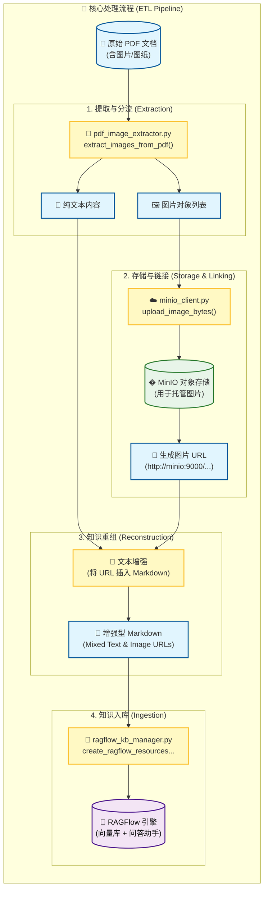

# 🏭 RAGFlow 设备维保图文混答知识库 (MinIO集成版)

基于 **MinIO** 对象存储与 **RAGFlow** 的多模态知识库解决方案，专为处理包含大量图片的设备维保手册、操作指南设计。

## 📖 项目背景

在工业维保、设备操作手册等场景中，文档图文并茂（如电路图、零件分解图）。传统的纯文本 RAG 往往丢失了关键的图片信息，导致回答苍白无力。

本项目通过 **"图片-链接解耦"** 的架构解决此问题：
1. **自动提取** PDF 中的图片并存储至 MinIO。
2. **替换** 原文图片为 MinIO 的公开访问 URL。
3. **构建** 包含Markdown语法的“增强文本”并上传至 RAGFlow。

最终实现：**大模型回答问题时，能直接调用并展示文档原图，实现真正的“图文混答”。**

---

## 🏗️ 系统架构

### � 数据流向与核心模块

本系统作为一个 **中间件 (Middleware)** 运行在 原始文档 与 RAGFlow 引擎之间。



---

## 💻 代码阅读指南 (核心逻辑解析)

为了方便理解系统如何工作，建议按以下顺序阅读核心脚本：

### 1. 基础设施层：`minio_client.py`
- **核心职能**：负责与 MinIO 对象存储交互。
- **关键设计**：
  - `create_bucket_if_not_exists`: **自动化运维**的关键。它不仅创建 Bucket，还会自动设置 `public-read` 策略。
  - **为什么这么做？** RAGFlow 是一个 Web 应用，它需要直接通过 HTTP GET 请求访问图片。如果图片不公开，前端展示将非常复杂（需要签名 URL 等）。本项目选择内网安全环境下的公开读取策略，换取极佳的兼容性。

### 2. 多模态提取层：`pdf_image_extractor.py`
- **核心职能**：PDF 解析工厂。
- **关键逻辑** (`extract_images_from_pdf`)：
  - 使用 `PyMuPDF (fitz)` 打开 PDF。
  - **双路提取**：
    - 一路提取文字 (`page.get_text()`)。
    - 一路提取图片 (`page.get_images()`)。
  - **清洗与重命名**：从 PDF 提取的图片通常文件名是随机的（如 `image3.png`）。本脚本会根据 PDF 文件名 + 页码 + 图片序号生成语义化文件名（如 `machine_manual_page3_img1.png`），方便后续溯源。

### 3. 业务编排层：`ragflow_pdf_processor.py`
- **核心职能**：主程序入口（Controller）。
- **逻辑流**：
  1. 初始化环境（读取 `.env`）。
  2. 调用提取器处理 PDF，拿到图片 URL 列表。
  3. 生成包含 `` 标签的 Markdown 文件。
  4. 调用 `ragflow_kb_manager.py` 将这些 Markdown 上传到 RAGFlow，并自动创建对应的 ChatBot。

### 4. 知识自动化层：`ragflow_kb_manager.py`
- **核心职能**：这是自动化运维的核心脚本，调用 RAGFlow Python SDK。
- **关键逻辑**：
  - **Clean & Build 策略**：每次运行前会自动查找并删除同名旧知识库，确保每次演示都是全新的环境。
  - **"Naive" 分块**：配置 `chunk_method="naive"` 且不开启 RAPTOR，这是为了配合预处理好的 Markdown 文件。因为我们已经人工分好页了，不需要 RAGFlow 再进行复杂的语义切分，直接"原样入库"效果最好。
  - **Prompt 注入**：自动创建 ChatBot 时，会注入一段精心设计的 Prompt，其中包含 `` 必须原样输出的 System Instruction。


---

## 🚀 从 0 到 1 运行指南

### 第一步：环境准备
确保您已经部署了以下服务：
1. **RAGFlow** (服务端已运行)
2. **MinIO** (对象存储服务已运行)
3. **Python 3.8+** (本地运行环境)

### 第二步：配置项目
1. 创建并激活虚拟环境（推荐）：
   ```bash
   python -m venv venv
   source venv/bin/activate  # Mac/Linux
   venv\Scripts\activate   # Windows
   ```
2. 安装依赖：
   ```bash
   pip install -r requirements.txt
   ```
3. 配置环境变量：
   填写env文件
   ```
 

### 第三步：运行处理脚本
使用提供的测试 PDF 或你自己的文档：

```bash
# 基础用法
python ragflow_pdf_processor.py 挖掘机维修案例.pdf
```

**脚本运行输出预演**：
> 1. 检测到 PDF 文件，开始提取...
> 2. 连接 MinIO 成功，Bucket 'ragflow-excavator-manual' 不存在，已自动创建并设为公开。
> 3. 第 1 页发现 2 张图片，上传成功...
> 4. 生成增强型 Markdown 文件：`挖掘机维修案例_page1_img.md`
> 5. 连接 RAGFlow，创建知识库... 创建助手成功！

### 第四步：验证与测试
1. **MinIO 验证**：
   打开 MinIO 控制台（默认 port 9001），查看是否创建了新的 bucket，且里面有图片文件。
2. **RAGFlow 验证**：
   进入 RAGFlow 界面，找到新生成的助手（ChatBot）。
   
---


---

## 💡 工程设计思考

### 为什么选择 MinIO 而不是直接存 Base64？
- **性能**：Base64 编码会使文本体积膨胀 33%，对于大模型上下文窗口是巨大的浪费。
- **标准化**：URL 是互联网的标准资源定位符，所有 Markdown 渲染器都支持。
- **解耦**：将存储压力（Storage）从计算引擎（RAGFlow）中剥离，符合云原生架构原则。

### 为什么按页面切分 Markdown？
- **精准度**：PDF 的物理分页往往对应着自然的语义分隔。将每一页作为一个独立的 Document 传入 RAGFlow，有助于检索引擎更精准地定位到“这一页”的知识，而不是在一个巨大的 txt 文件中大海捞针。
- **图片定位**：图片通常属于当前页面的上下文，按页切分确保存储的图片与当前页文字紧密关联。

---

## ⚠️ 提示词工程关键提醒 (Prompt Engineering Note)

在设计 RAGFlow 的 System Prompt 时，**必须包含 `{knowledge}` 占位符**。

- **这是什么？** `{knowledge}` 是 RAGFlow 将检索到的知识片段注入给大模型的"插槽"。
- **如果没有它会怎样？** 大模型将收不到任何检索结果，只能进行"闭卷回答"（依靠预训练知识瞎编），导致回答错乱、幻觉严重，完全无法体现知识库的内容。
- **正确用法示例**：
  ```markdown
  你是一个智能助手...
  
  Here is the knowledge base:
  {knowledge}    <--- 必须保留这个！
  The above is the knowledge base.
  
  请根据上述知识库回答问题...
  ```
  只有保留了这个占位符，RAG 系统才能真正生效，实现"开卷考试"的效果。